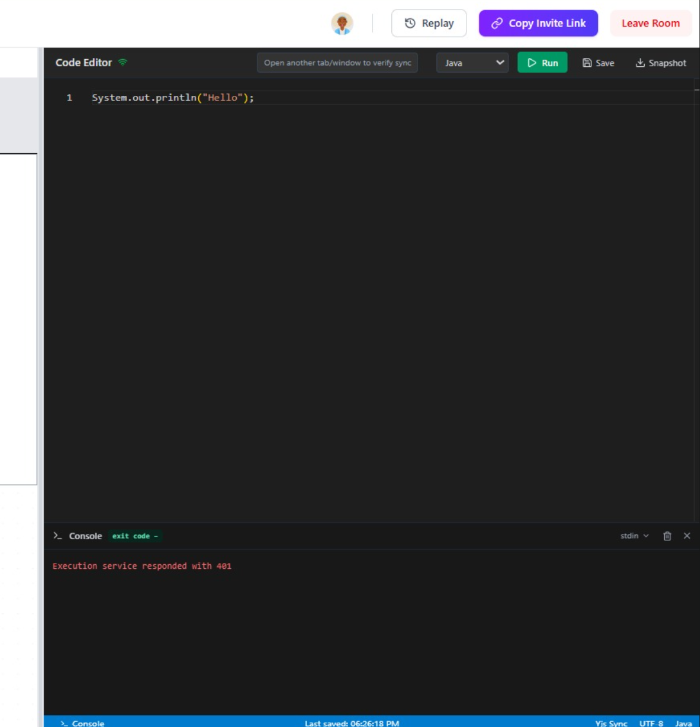
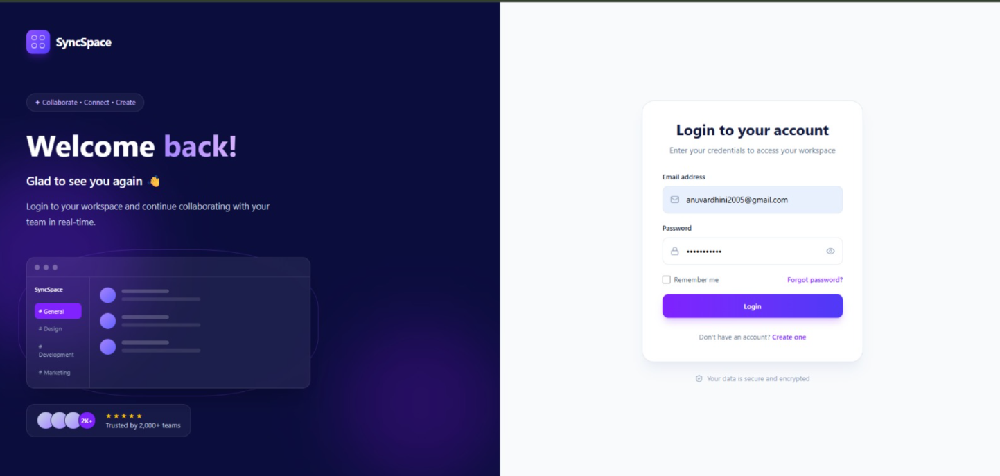
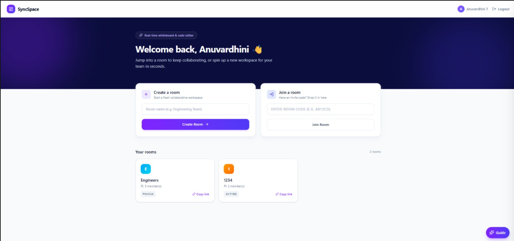
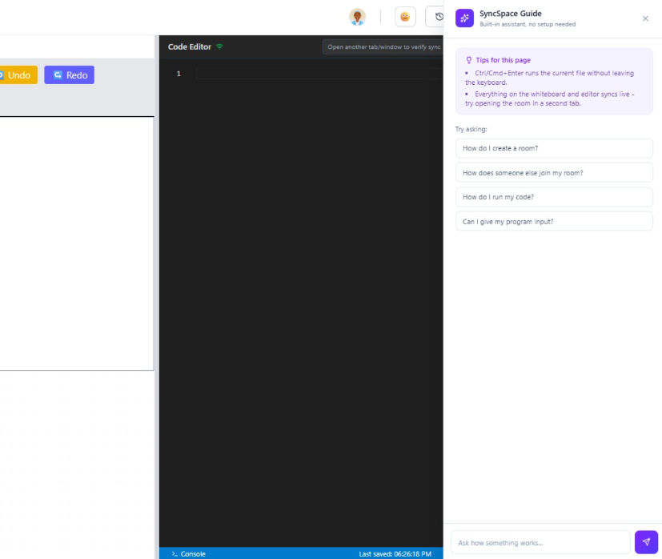

# 🚀 SyncSpace

## Real-Time Collaborative Whiteboard & Code Editor

<p align="center">
  <strong>Collaborate • Code • Design • Connect — In Real Time</strong>
</p>

<p align="center">
  A real-time collaborative engineering workspace that combines an interactive
  whiteboard, a runnable collaborative code editor, and a built-in product
  guide into one unified platform.
</p>

<p align="center">
  
  
  
  
  
  
  
  
  
</p>

---

## 📑 Table of Contents

* [🌐 About](#-about)
* [❗ Problem Statement](#-problem-statement)
* [💡 Solution](#-solution)
* [🎯 Use Cases](#-use-cases)
* [✨ Key Features](#-key-features)
* [🆕 What's New](#-whats-new)
* [📸 Project Screenshots](#-project-screenshots)
* [🔄 How It Works](#-how-it-works)
* [🏗️ System Architecture](#️-system-architecture)
* [🧰 Tech Stack](#-tech-stack)
* [🧬 CRDT Architecture](#-crdt-architecture)
* [🔐 Authentication](#-authentication)
* [💾 Persistence](#-persistence)
* [🎬 Session Replay](#-session-replay)
* [▶️ Run & Compile Code](#️-run--compile-code)
* [🌓 Light / Dark Mode](#-light--dark-mode)
* [✨ AI Guide](#-ai-guide)
* [⌘ Command Palette](#-command-palette)
* [🎉 Live Reactions](#-live-reactions)
* [📡 Socket.IO Events](#-socketio-events)
* [📂 Project Structure](#-project-structure)
* [🚀 Installation](#-installation)
* [🧪 Testing](#-testing)
* [📈 Development Journey](#-development-journey)
* [👥 Team Members](#-team-members)
* [🔮 Future Enhancements](#-future-enhancements)
* [📜 License](#-license)

---

# 🌐 About

**SyncSpace** is a real-time collaborative engineering workspace designed for modern development teams, technical interviews, system-design discussions, pair programming, and remote collaboration.

The platform combines:

* 🎨 Collaborative Whiteboard
* 💻 Collaborative Code Editor with **live Run/Compile output**
* ⚡ Real-Time Communication
* 🧬 Yjs CRDT Synchronization
* 👥 Live User Awareness
* 🏠 Room-Based Collaboration
* 🔐 Secure Authentication
* 💾 Persistent Data Storage
* 🎬 Session Replay
* 🌓 Light / Dark Theme
* ✨ Built-in AI Guide (no external API required)
* ⌘ Command Palette (Ctrl/Cmd+K)
* 🎉 Live Emoji Reactions

Multiple users can join the same room and simultaneously work on diagrams, source code, and code execution while seeing changes in real time.

---

# ❗ Problem Statement

Traditional web applications primarily follow a request/response model.

Building a system where multiple users can simultaneously:

* Draw on the same canvas
* Edit the same code document
* Run and see code output together
* See changes instantly
* Avoid race conditions
* Prevent accidental overwrites
* Maintain consistent shared state

requires advanced real-time synchronization mechanisms.

A simple last-write-wins approach can cause updates to be lost when multiple users modify the same content at nearly the same time.

SyncSpace addresses this problem using **WebSockets, Socket.IO, and Yjs CRDT technology**.

---

# 💡 Solution

SyncSpace combines real-time communication with conflict-free synchronization.

```text
                    SyncSpace
                        │
        ┌───────────────┴────────────────┐
        │                                │
        ▼                                ▼
  🎨 Whiteboard              💻 Code Editor + Run Console
        │                                │
        │                                │
        └───────────────┬────────────────┘
                        │
                        ▼
                  🧬 Yjs CRDT
                        │
                        ▼
                 📡 Socket.IO
                        │
                        ▼
                Node.js + Express
                        │
                        ▼
                    MongoDB
```

Yjs maintains shared collaborative document state, while Socket.IO provides low-latency bidirectional communication between connected clients.

---

# 🎯 Use Cases

## 👨‍💻 Technical Interviews

An interviewer can discuss system architecture on the whiteboard while a candidate writes **and runs** code simultaneously, with live output visible to both.

## 🏗️ System Design

Teams can collaboratively create:

* System architecture diagrams
* Database designs
* API workflows
* Microservice diagrams
* Data-flow diagrams

## 👥 Distributed Engineering Teams

Remote developers can collaborate on technical designs and implementation, reacting live with emojis instead of breaking flow to type chat.

## 💻 Pair Programming

Multiple developers can edit — and execute — the same code document simultaneously.

## 🎓 Remote Workshops

Teachers and students can collaboratively solve programming and system-design problems, with the in-app Guide answering "how do I…" questions on the spot.

## 🧠 Brainstorming

Teams can visually explore ideas using the shared collaborative whiteboard.

---

# ✨ Key Features

## 🎨 Collaborative Whiteboard

The interactive whiteboard supports:

* ✏️ Pencil
* 🧽 Eraser
* ─ Line
* ▭ Rectangle
* ◯ Circle
* 📝 Text
* ↶ Undo
* ↷ Redo
* 🗑️ Clear Canvas
* 📥 PNG Download
* ⚡ Real-Time Synchronization

Changes made by one user are immediately synchronized with other users in the same room.

---

## 💻 Collaborative Code Editor

SyncSpace integrates **Monaco Editor**, the editor technology behind Visual Studio Code.

Features include:

* Syntax highlighting
* Real-time code editing
* Concurrent editing
* Yjs shared document
* Remote cursor awareness
* User presence
* Conflict-free synchronization
* **One-click Run/Compile with a live output console** (see [Run & Compile Code](#️-run--compile-code))

---

## 🧬 Yjs CRDT Synchronization

SyncSpace uses **Yjs Conflict-free Replicated Data Types (CRDTs)** to handle concurrent document editing.

```text
             ┌──────────────────┐
 User A ────►│                  │
             │    Yjs CRDT      │
 User B ────►│                  │
             │                  │
             └────────┬─────────┘
                      │
                      ▼
             Shared Consistent State
```

Concurrent updates are merged into a consistent shared state instead of simply overwriting previous changes.

---

# 🆕 What's New

A round of polish focused on making the product feel complete end-to-end, without introducing any tech outside the existing stack:

| Feature | Summary |
| --- | --- |
| ▶️ **Run & Compile** | Execute the current file (JS, TypeScript, Python, Java, C++) and see stdout/stderr/exit code in a console panel, without leaving the editor. |
| 🌓 **Light / Dark Mode** | App-wide theme toggle, persisted per-browser, built with Tailwind's class-based `dark:` variant. |
| ✨ **AI Guide** | A floating side-panel assistant that answers "how do I…" questions about SyncSpace itself, powered by an in-app knowledge base — no external API key required. |
| ⌘ **Command Palette** | `Ctrl/Cmd+K` opens a searchable list of actions — create/join a room, run code, toggle theme, open the guide, log out. |
| 🎉 **Live Reactions** | A quick emoji picker in the workspace topbar broadcasts a floating reaction to everyone in the room in real time. |
| 🖥️ **Refreshed UI** | Cleaned-up Login/Signup flows, a working "Forgot password" screen, and a redesigned dashboard with room cards, empty states, and loading skeletons. |

---

# 📸 Project Screenshots

> **Add your actual SyncSpace screenshots to `docs/screenshots/` and use the filenames below.**

## 🏠 Dashboard


---

## 🎨 Collaborative Whiteboard


---

## 💻 Collaborative Code Editor & Run Console



---

## 👥 Real-Time Collaboration


---

## 🔐 Login / Authentication



---

## 🏠 Collaborative Room



---

## ✨ AI Guide & Command Palette



---

### 📁 Recommended Screenshot Folder

Create this structure inside your project:

```text
SyncSpace-RealTime-Collaboration/
│
├── BACKEND/
├── FRONTEND/
├── docs/
│   └── screenshots/
│       ├── dashboard.png
│       ├── login.png
│       ├── room.png
│       ├── whiteboard.png
│       ├── code-editor.png
│       ├── collaboration.png
│       └── guide.png
│
├── .gitignore
└── README.md
```

Then GitHub will automatically render the screenshots in the README.

---

# ⚡ Real-Time Communication

SyncSpace uses **Socket.IO** for low-latency bidirectional communication.

Socket communication supports:

* Room events (join/leave, presence)
* Whiteboard synchronization
* Yjs synchronization
* User presence
* Awareness updates
* Join / leave events
* Connection status
* Remote cursor updates
* Live emoji reactions

```text
Client A
   │
   │ WebSocket
   ▼
┌────────────────┐
│   Socket.IO    │
│     Server     │
└───────┬────────┘
        │
        ├──────────────► Client B
        │
        └──────────────► Client C
```

---

# 👥 Live User Awareness

Users can see other collaborators through:

* 👤 User names
* 🎨 User colors
* 🟢 Online status
* 🖱️ Remote cursor positions
* 🔔 Join notifications
* 🔔 Leave notifications
* 👥 Active user indicators
* 🎉 Live floating reactions

---

# 🏠 Room-Based Collaboration

Every collaborative session operates inside an isolated room.

```text
                    SyncSpace
                        │
              ┌─────────┴─────────┐
              │                   │
           Room A              Room B
              │                   │
        ┌─────┼─────┐         ┌───┴───┐
        │     │     │         │       │
      User  User  User      User    User
```

Users inside one room receive collaboration updates from their own session without mixing data from other rooms.

---

# 🔐 Authentication

SyncSpace implements secure authentication using:

* JWT authentication
* bcrypt password hashing
* Protected REST APIs
* Authenticated Socket.IO connections
* Room membership authorization

Authentication flow:

```text
              User
                │
                ▼
          Register / Login
                │
                ▼
        Backend Validation
                │
                ▼
             JWT Token
                │
        ┌───────┴────────┐
        │                │
        ▼                ▼
    REST APIs        Socket.IO
        │                │
        ▼                ▼
  Protected       JWT Verification
   Routes                │
                        ▼
                 Room Validation
                        │
                        ▼
                  Collaboration
```

---

# 💾 Persistence

MongoDB is used for persistent application data.

The system stores information related to:

* 👤 Users
* 🏠 Rooms
* 🎨 Whiteboards
* 💻 Code documents
* 🧬 Collaborative document state
* 📜 Session history / replay events

Persistence allows important application data to survive server restarts.

---

# 🎬 Session Replay

SyncSpace includes session history and replay capabilities.

Replay functionality supports:

* 🎨 Whiteboard evolution
* 💻 Code changes
* 👥 Collaboration history
* ⏱️ Timeline-based navigation
* 📊 Interview/session review

```text
00:00 ────────────────●──────────────── 05:30
                       ▲
                     Current

          ◀ Previous    ▶ Play    Next ▶
```

---

# ▶️ Run & Compile Code

The code editor toolbar has a **Run** button (or `Ctrl/Cmd+Enter`) that executes the current file and streams the result into a console panel docked at the bottom of the editor.

* **Languages:** JavaScript, TypeScript, Python, Java, C++
* **Console shows:** stdout, stderr, exit code, and whether compilation failed
* **stdin support:** an optional input box lets you feed the program standard input before running
* **Execution engine:** [Piston](https://github.com/engineer-man/piston), a free, sandboxed, multi-language execution API — no API key or extra infrastructure needed, keeping the feature inside the project's existing (no-new-dependency) footprint

```text
Click Run (or Ctrl/Cmd+Enter)
          │
          ▼
   FRONTEND/src/lib/codeRunner.js
          │
          ▼
     Piston Execution API
          │
          ▼
  { stdout, stderr, exitCode }
          │
          ▼
     Console Panel
```

This runs independently of the Yjs sync layer — it executes whatever is currently in the shared document, so everyone in the room is always testing the same code.

---

# 🌓 Light / Dark Mode

A theme toggle (sun/moon icon in the sidebar) switches the whole app between light and dark, persisted in `localStorage` so it's remembered on the next visit.

* Implemented with Tailwind CSS v4's CSS-first `@custom-variant dark` (class-based, not OS-media-query-based)
* Covers the dashboard, sidebar, topbar, code console, join page, and guide panel
* State lives in `FRONTEND/src/context/ThemeContext.jsx`

---

# ✨ AI Guide

A floating **Guide** button opens a side panel that can answer questions about how to use SyncSpace — creating rooms, running code, the whiteboard tools, replay, shortcuts, and more.

Rather than depending on an external LLM API (which the project's stack doesn't currently provision), the Guide is powered by a small keyword-matching knowledge base (`FRONTEND/src/lib/guideKnowledge.js`), so it works offline, instantly, and at zero cost. It also surfaces contextual tips depending on which page you're on (dashboard vs. workspace).

> Swapping in a real LLM later only requires replacing the `answerGuideQuestion()` function — the panel UI stays the same.

---

# ⌘ Command Palette

Press **`Ctrl/Cmd+K`** anywhere in the app to open a searchable command list:

* Go to Dashboard
* Create / Join a Room
* Toggle theme
* Open the AI Guide
* Log out

Navigate with the arrow keys, confirm with `Enter`, dismiss with `Esc`.

---

# 🎉 Live Reactions

An emoji picker in the workspace topbar lets anyone send a quick reaction (👍 🎉 😂 👀 🔥 ❤️) that floats up and fades on **everyone's** screen in that room — a lightweight way to react during a pairing session or interview without switching to a chat box.

Implemented as a thin, unpersisted relay: the frontend emits `room:reaction`, and `BACKEND/src/sockets/roomSocket.js` re-broadcasts it to everyone else currently in that room.

---

# 🔄 How It Works

## 🎨 Whiteboard Collaboration

```text
User A Draws
      │
      ▼
HTML Canvas
      │
      ▼
Drawing Event
      │
      ▼
Socket.IO
      │
      ▼
Backend Room
      │
      ├───────────────┐
      ▼               ▼
   User B           User C
      │               │
      ▼               ▼
Canvas Update     Canvas Update
```

## 💻 Code Collaboration

```text
User A
  │
  ▼
Monaco Editor
  │
  ▼
Y.Doc
  │
  ▼
Yjs Update
  │
  ▼
Socket.IO
  │
  ▼
Node.js Backend
  │
  ▼
Other Clients
  │
  ▼
Yjs Merge
  │
  ▼
Monaco Editor
```

## ▶️ Run Collaboration

```text
Anyone clicks Run
        │
        ▼
Current Y.Doc contents read locally
        │
        ▼
   Piston API call
        │
        ▼
Result rendered in that
user's console panel only
```

---

# 🏗️ System Architecture

```text
                         ┌─────────────────────┐
                         │       CLIENTS       │
                         │                     │
                         │    React + Vite     │
                         └──────────┬──────────┘
                                    │
              ┌─────────────────────┼─────────────────────┐
              │                     │                     │
              ▼                     ▼                     ▼
       🎨 WHITEBOARD        💻 CODE EDITOR          ✨ AI GUIDE /
                             + RUN CONSOLE          ⌘ COMMAND PALETTE
              │                     │                     │
              └─────────────────────┼─────────────────────┘
                                    │
                                    ▼
                            ┌────────────────┐
                            │    Socket.IO   │
                            │   WebSockets   │
                            └───────┬────────┘
                                    │
                                    ▼
                         ┌────────────────────┐
                         │ Node.js + Express  │
                         │                    │
                         │ Authentication     │
                         │ Room Management    │
                         │ Socket Handlers    │
                         │ Yjs Synchronization│
                         └─────────┬──────────┘
                                   │
                       ┌───────────┴───────────┐
                       │                       │
                       ▼                       ▼
                 ┌──────────┐             ┌──────────┐
                 │   Yjs    │             │ MongoDB  │
                 │   CRDT   │             │          │
                 └──────────┘             └──────────┘

              (Run button calls the external Piston
               execution API directly from the client)
```

---

# 🧰 Tech Stack

| Layer                | Technology             |
| -------------------- | ----------------------- |
| 🎨 Frontend          | React 19                |
| ⚡ Build Tool         | Vite                    |
| 🖌️ Whiteboard       | HTML5 Canvas            |
| 💻 Code Editor       | Monaco Editor           |
| ▶️ Code Execution     | Piston API (client-side call, no key needed) |
| 🔄 Synchronization   | Yjs CRDT                |
| 📡 Real-Time         | Socket.IO / WebSockets  |
| 🖥️ Backend          | Node.js                 |
| 🌐 API               | Express.js              |
| 🗄️ Database         | MongoDB                 |
| 🧩 ODM               | Mongoose                |
| 🔐 Authentication    | JWT                     |
| 🔑 Password Security | bcryptjs                |
| 🧭 Routing           | React Router            |
| 🎨 Styling           | Tailwind CSS v4 (class-based dark mode) |
| 🖼️ Icons            | Lucide React            |

No new runtime dependencies were introduced for Run/Compile, theming, the AI Guide, the Command Palette, or Live Reactions — all built on top of the libraries already in `package.json`.

---

# 🧬 CRDT Architecture

SyncSpace uses a Yjs shared document to maintain collaborative code state.

```text
                         Y.Doc
                           │
               ┌───────────┼───────────┐
               │           │           │
               ▼           ▼           ▼
            Y.Text       Y.Map       Y.Array
               │
               ▼
         Monaco Editor
```

When multiple users edit simultaneously:

```text
                  ┌──────────────┐
User A ──────────►│              │
                  │   Yjs CRDT   │
User B ──────────►│              │
                  └──────┬───────┘
                         │
                         ▼
                Shared Consistent State
```

---

# 📡 Socket.IO Events

## Room Events

```text
room:join
room:leave
room:users
room:state
room:reaction        ← NEW: live emoji reactions
user:connected
user:disconnected
```

## Whiteboard Events

```text
whiteboard:join
whiteboard:startDrawing
whiteboard:drawing
whiteboard:endDrawing
whiteboard:clear
```

## Editor Events

```text
joinEditor
yjsSync
yjsAwareness
```

## Chat Events

```text
chat:join
chat:message
```

---

# 📂 Project Structure

```text
SyncSpace-RealTime-Collaboration/
│
├── BACKEND/
│   ├── src/
│   │   ├── config/
│   │   ├── controllers/
│   │   │   ├── authController.js
│   │   │   ├── chatController.js
│   │   │   ├── roomController.js
│   │   │   ├── userController.js
│   │   │   └── whiteboardController.js
│   │   ├── middleware/
│   │   ├── models/
│   │   │   ├── User.js
│   │   │   ├── Room.js
│   │   │   ├── Code.js
│   │   │   ├── Whiteboard.js
│   │   │   ├── Chat.js
│   │   │   └── ReplayEvent.js
│   │   ├── routes/
│   │   ├── sockets/
│   │   │   ├── index.js
│   │   │   ├── roomSocket.js       (now also relays room:reaction)
│   │   │   ├── editorSocket.js
│   │   │   ├── whiteboardSocket.js
│   │   │   ├── chatSocket.js
│   │   │   └── socketAuth.js
│   │   ├── utils/
│   │   ├── app.js
│   │   └── server.js
│   │
│   └── package.json
│
├── FRONTEND/
│   ├── src/
│   │   ├── api/
│   │   ├── Components/
│   │   │   ├── Login.jsx
│   │   │   ├── Signup.jsx
│   │   │   ├── RoomList.jsx          (dashboard)
│   │   │   ├── JoinRoom.jsx
│   │   │   ├── WorkspaceLayout.jsx
│   │   │   ├── Workspace.jsx
│   │   │   ├── Sidebar.jsx
│   │   │   ├── Topbar.jsx
│   │   │   ├── CodeEditorPane.jsx    (Run/Compile console)
│   │   │   ├── AIGuide.jsx           (NEW)
│   │   │   ├── CommandPalette.jsx    (NEW)
│   │   │   ├── ReactionLayer.jsx     (NEW)
│   │   │   ├── ReplayPanel.jsx
│   │   │   ├── ProtectedRoute.jsx
│   │   │   └── UI/
│   │   │       └── ForgotPassword.jsx
│   │   ├── context/
│   │   │   ├── AuthContext.jsx
│   │   │   └── ThemeContext.jsx      (NEW)
│   │   ├── hooks/
│   │   │   └── useRoomPresence.js
│   │   ├── lib/
│   │   │   ├── socketYjsProvider.js
│   │   │   ├── codeRunner.js         (NEW — Piston API wrapper)
│   │   │   └── guideKnowledge.js     (NEW — AI Guide knowledge base)
│   │   ├── App.jsx
│   │   └── main.jsx
│   │
│   └── package.json
│
├── docs/
│   └── screenshots/
│       ├── dashboard.png
│       ├── login.png
│       ├── room.png
│       ├── whiteboard.png
│       ├── code-editor.png
│       ├── collaboration.png
│       └── guide.png
│
├── .gitignore
└── README.md
```

---

# 🚀 Installation

## Prerequisites

Install:

* Node.js 22+
* npm
* MongoDB
* Git

---

## 1️⃣ Clone Repository

```bash
git clone https://github.com/anuvardhini25/SyncSpace-RealTime-Collaboration.git
cd SyncSpace-RealTime-Collaboration
```

---

## 2️⃣ Backend Setup

```bash
cd BACKEND
npm install
```

Create a `.env` file:

```env
PORT=5001
MONGO_URI=mongodb://127.0.0.1:27017/syncspace
JWT_SECRET=your_secure_jwt_secret
CLIENT_URL=http://localhost:5173
```

Start the backend:

```bash
npm run dev
```

Backend:

```text
http://localhost:5001
```

---

## 3️⃣ Frontend Setup

Open another terminal:

```bash
cd FRONTEND
npm install
```

Start the frontend:

```bash
npm run dev
```

Frontend:

```text
http://localhost:5173
```

> **Note:** The Run/Compile feature calls the public Piston execution API (`https://emkc.org`) directly from the browser — no extra setup or API key is required, but it does need outbound internet access from wherever the frontend runs.

---

# 🧪 Testing

## Test 1 — Room Collaboration

Open SyncSpace in two browser tabs and join the same room.

```text
Tab A ─────────┐
               ├── Same Room
Tab B ─────────┘
```

---

## Test 2 — Whiteboard

Draw a shape or freehand stroke in Tab A.

Expected result:

```text
Tab A
  │
  ▼
 Draw
  │
  ▼
Socket.IO
  │
  ▼
Tab B
  │
  ▼
Drawing Appears
```

---

## Test 3 — Code Editor

Type code in Tab A.

Expected result:

```text
Tab A
  │
  ▼
Monaco
  │
  ▼
Yjs
  │
  ▼
Socket.IO
  │
  ▼
Tab B
  │
  ▼
Code Synchronized
```

---

## Test 4 — Concurrent Editing

Both users edit the same document simultaneously.

Expected result:

```text
User A ──┐
         ├──► Yjs CRDT ──► Shared Consistent State
User B ──┘
```

---

## Test 5 — Run & Compile

Write a short "Hello, World" program, click **Run** (or `Ctrl/Cmd+Enter`).

Expected result: the console panel opens and shows the program's output and exit code within a few seconds.

---

## Test 6 — Live Reactions

Click the emoji picker in the topbar from Tab A.

Expected result: the emoji floats up on both Tab A and Tab B's screens.

---

# 📈 Development Journey

## Week 1 — Foundation ✅

* [x] React + Vite setup
* [x] Express backend
* [x] Socket.IO infrastructure
* [x] Room creation
* [x] Room joining
* [x] Split-screen workspace
* [x] Dashboard
* [x] Navigation

## Week 2 — Real-Time Collaboration ✅

* [x] Yjs CRDT integration
* [x] Socket.IO synchronization
* [x] Monaco Editor
* [x] Collaborative code editing
* [x] Whiteboard drawing
* [x] Remote cursor awareness
* [x] User presence
* [x] Real-time canvas synchronization

## Mid-Project Review ✅

* [x] Multi-client synchronization testing
* [x] Whiteboard synchronization testing
* [x] Remote cursor verification
* [x] User awareness verification

## Week 3 — Persistence ✅

* [x] MongoDB integration
* [x] Code persistence
* [x] Whiteboard persistence
* [x] Collaborative document persistence
* [x] Session recovery

## Week 4 — Security & Replay ✅

* [x] JWT authentication
* [x] Protected routes
* [x] Socket authentication
* [x] Room membership authorization
* [x] Session history
* [x] Whiteboard replay
* [x] Code replay
* [x] Replay timeline

## Week 5 — Polish & Product Features ✅

* [x] Run/Compile console for the code editor
* [x] Light / dark theme
* [x] AI Guide side panel
* [x] Command palette (Ctrl/Cmd+K)
* [x] Live emoji reactions
* [x] Dashboard, auth, and topbar redesign

## Final Review ✅

* [x] Real-time collaboration
* [x] Conflict-free synchronization
* [x] Whiteboard integration
* [x] Collaborative code editor with execution
* [x] Authentication
* [x] Persistence
* [x] Session replay
* [x] Error handling
* [x] Reconnection handling
* [x] Integration testing

---

# 👥 Team Members

SyncSpace is developed as a collaborative team project.

| # | Team Member                     |
| - | -------------------------------- |
| 1 | **Anuvardhini T**                |
| 2 | **Tarun Singh**                  |
| 3 | **Shreya Kumari**                |
| 4 | **Chamarthi Venkatapathi Raju**  |
| 5 | **M. Devi Akshya Priya**         |
| 6 | **Aman Panda**                   |

> Add the 7th team member here if your final team contains seven members.

---

# 🏆 Project Highlights

SyncSpace demonstrates practical implementation of:

| Area                       | Technology                |
| --------------------------- | -------------------------- |
| ⚡ Real-Time Communication  | WebSockets / Socket.IO     |
| 🧬 Conflict Resolution     | Yjs CRDT                   |
| 🎨 Collaborative Drawing   | HTML5 Canvas               |
| 💻 Collaborative Coding    | Monaco Editor              |
| ▶️ Code Execution           | Piston API integration     |
| 🔐 Security                | JWT + bcrypt               |
| 🏠 Session Isolation       | Room-Based Architecture    |
| 💾 Data Persistence        | MongoDB                    |
| 👥 User Awareness          | Yjs Awareness + Presence   |
| 🔄 State Synchronization   | Yjs + Socket.IO            |
| 🎬 Session Replay          | Replay Timeline            |
| 🌓 Theming                 | Tailwind v4 class-based dark mode |
| ✨ In-App Assistance        | Rule-based AI Guide        |
| ⌘ Productivity              | Command Palette             |

---

# 🔮 Future Enhancements

Possible future improvements include:

* 🎥 Video conferencing
* 🎙️ Voice communication
* 🖥️ Screen sharing
* 🤖 Upgrading the AI Guide to a real LLM-backed assistant (currently rule-based by design, to avoid requiring an API key)
* 🧠 AI code review
* 🏗️ AI architecture suggestions
* 🌓 Dark-themed whiteboard canvas (currently the surrounding UI supports dark mode; the canvas itself stays light)
* 📊 Interview analytics
* 📝 Session reports
* 👥 Team management
* 🔑 Advanced role-based permissions
* ☁️ Cloud deployment
* 📈 Redis-based Socket.IO scaling
* 🐳 Docker support
* ☸️ Kubernetes deployment
* 🖥️ Self-hosted code execution sandbox (replacing the public Piston API for stricter environments)

---

# 📜 License

This project is developed for educational, academic, and demonstration purposes.

---

<p align="center">
  <strong>🚀 SyncSpace</strong>
</p>

<p align="center">
  Collaborate • Code • Design • Connect
</p>

<p align="center">
  <em>A real-time collaborative engineering workspace.</em>
</p>
